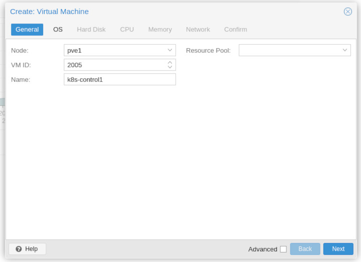
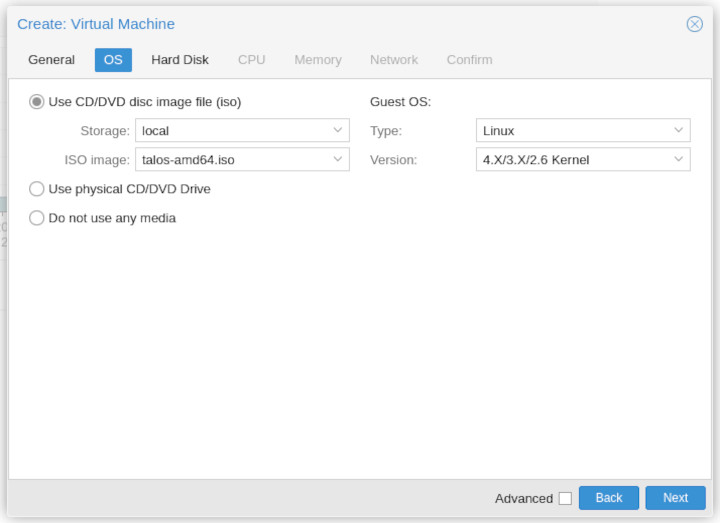
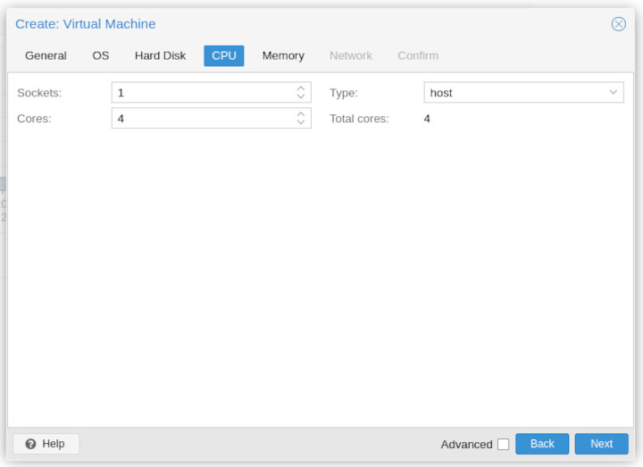
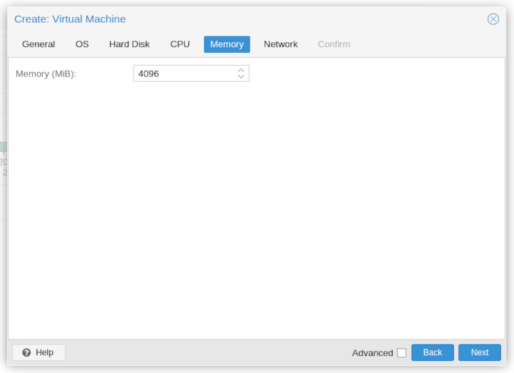
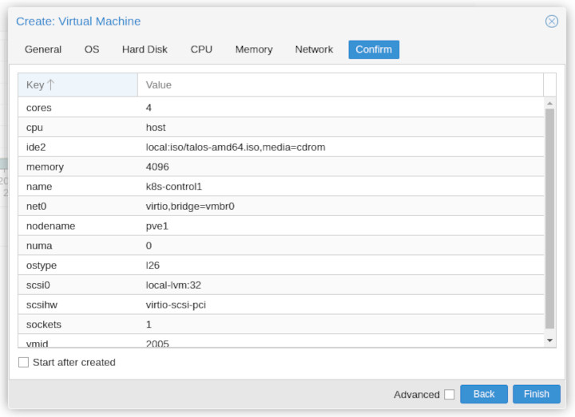

# Kubernetes Zero to Hero

Kubernetes is a container orchestration and management platform. Kubernetes is much more than that though - it can manage ingress to services and manage many different storage classes for various types of storage within the cluster.

In this series we'll investigate how to get a complete service up and running on a new kubernetes cluster that we set up ourselves. There's quite a lot to kubernetes and managed services like Amazon EKS and Azure's AKS offer a range of ingress and storage classes right out of the box. We'll need to get our hands dirty and install some of those for ourselves.

The series will:

1. Install a highly available kubernetes cluster on a number of virtual machines.
2. [Introduce ingress control and load balancing](2-ingress-and-loadbalancing.md)
3. [Add Cluster Storage](3-storage.md)

## Host OS - TALOS

It is best for kubernetes to be the single thing that a server does and to this end you need a minimal OS to host the kubernetes API and container services.

[TALOS](https://www.talos.dev/) is an excellent demonstration of just how good that can get.

# On Virtualisation

You can choose to put TALOS on bare metal you have lying around or else you can choose to put it on a VM under a hypervisor you already have. This is probably easiest for getting up and running.

Here's the Proxmox how-to:

```shell
$ curl -sL https://talos.dev/install | sh
```

For Proxmox Virtual Machines to boot into the OS we need to provide a CDROM ISO to boot from. Download that as well:

```shell
$ curl https://github.com/talos-systems/talos/releases/download/v1.2.6/talos-amd64.iso -L -o talos-amd64.iso
```

It's a mere 77MiB for v1. It's likely to stay around this size as it's mainly just a hardended linux kernel and a couple of services running. Nothing more.

## Create the VMs

Upload the ISO to Proxmox so it's available for booting a Virtual Machine with. Make sure the machine is in a DHCP scope so it manages to get an IP address when it boots. If you want to manually configure the networking then you'll need to boot from the ISO and press `e` at the grub screen in order to add netowkring information to the kernel command line.

Generate at least 4 VMs in Proxmox for your Kubernetes cluster (a control node and three worker nodes). If you want, create more and you can have a highly available control plane aswell. It's just important to get 3+ worker nodes.







I tend to choose the `host` processor type for maximum performance. My poor little i7 in the loft needs all the help it can get!





I suggest you add a serial port - the Talos kernel boot options are configured for it. This way you have a scrollable set of startup messages and you can copy and paste IP addresses from it.

I tend to make all of the nodes equal, except I give more space for disk on the worker nodes because this is where our storage classes will live and any storage we need for the cluster will essentially be spread across the worker nodes as we get up and running.

# Boot the cluster

You can **start all of the virtual machines** with the ISO mounted. This will end with the Talos OS installed. Each talos node will have an IP address that we'll use to configure it with later.

The output will look similar to the following on each node:

```
[    6.637632] [talos] task loadConfig (1/1): this machine is reachable at:
[    6.639538] [talos] task loadConfig (1/1):  192.168.1.26
```

The first thing we do is to generate a set of config for talos. This just generates some YAML files that have some basic settings in. We pass in the control plane IP so the first control plane IP is in the configuration files. Later on when we register worker nodes, they'll know how to communicate with the control plane via this IP address.


## Generate Machine Configurations

Let's get some configuration on the go. Export the IP address of the first control plane node you want to use as we'll use that IP address a few times whilst bootstrapping the cluster:

```shell
$ export CONTROL_PLANE_IP=192.168.1.26
$ mkdir config
$ talosctl gen config talos-pmx-cluster https://$CONTROL_PLANE_IP:6443 --output-dir config
```

:::note

It's worth cracking open the YAML files now and having a browse at what is contained in these YAML files. For example, if you want to configure a proxy to be used you'll want to edit these YAML files in order to tell Talos about the proxy.

:::

## Apply the Control Plane Configuration

```shell
$ talosctl apply-config --insecure --nodes $CONTROL_PLANE_IP --file config/controlplane.yaml
```

You'll see some of the following happening on the control plane node:

```
  129.462754] [talos] service[containerd](Running): Process Process(["/bin/containerd" "--address" "/system/run/containerd/containerd.sock" "--state" "/system/run/containerd" "--root" "/system/var/lib/containerd"]) started with PID 697
[  129.528646] [talos] service[containerd](Running): Health check successful
[  129.530915] [talos] task startContainerd (1/1): done, 1.410583778s
[  129.532382] [talos] phase containerd (3/13): done, 1.413426258s
[  129.533834] [talos] phase install (4/13): 1 tasks(s)
[  129.535053] [talos] task install (1/1): starting
[  129.547572] [talos] pulling "ghcr.io/siderolabs/installer:v1.0.0"
[  142.983129] 2022/04/04 21:32:27 running Talos installer v1.0.0
[  143.000402] 2022/04/04 21:32:28 creating new partition table on /dev/sda
[  143.002239] 2022/04/04 21:32:28 logical/physical block size: 512/512
[  143.003737] 2022/04/04 21:32:28 minimum/optimal I/O size: 512/512
[  143.188848] 2022/04/04 21:32:28 partitioning /dev/sda - EFI "105 MB"
[  143.191108] 2022/04/04 21:32:28 created /dev/sda1 (EFI) size 204800 blocks
[  143.192948] 2022/04/04 21:32:28 partitioning /dev/sda - BIOS "1.0 MB"
[  143.194398] 2022/04/04 21:32:28 created /dev/sda2 (BIOS) size 2048 blocks
[  143.195928] 2022/04/04 21:32:28 partitioning /dev/sda - BOOT "1.0 GB"
[  143.197366] 2022/04/04 21:32:28 created /dev/sda3 (BOOT) size 2048000 blocks
[  143.199190] 2022/04/04 21:32:28 partitioning /dev/sda - META "1.0 MB"
[  143.200961] 2022/04/04 21:32:28 created /dev/sda4 (META) size 2048 blocks
[  143.202645] 2022/04/04 21:32:28 partitioning /dev/sda - STATE "105 MB"
[  143.204102] 2022/04/04 21:32:28 created /dev/sda5 (STATE) size 204800 blocks
[  143.206012] 2022/04/04 21:32:28 partitioning /dev/sda - EPHEMERAL "0 B"
[  143.208328] 2022/04/04 21:32:28 created /dev/sda6 (EPHEMERAL) size 64647101 blocks
[  143.216107] 2022/04/04 21:32:28 formatting the partition "/dev/sda1" as "vfat" with label "EFI"
[  143.258613] 2022/04/04 21:32:28 zeroing out "/dev/sda2"
[  143.265511] 2022/04/04 21:32:28 formatting the partition "/dev/sda3" as "xfs" with label "BOOT"
[  143.608276] 2022/04/04 21:32:28 zeroing out "/dev/sda4"
[  143.721381] 2022/04/04 21:32:28 zeroing out "/dev/sda5"
[  146.386674] 2022/04/04 21:32:31 zeroing out "/dev/sda6"
[  147.139783] XFS (sda3): Mounting V5 Filesystem
[  147.499091] XFS (sda3): Ending clean mount
[  147.562939] xfs filesystem being mounted at /boot supports timestamps until 2038 (0x7fffffff)
[  147.644487] 2022/04/04 21:32:32 copying /usr/install/amd64/vmlinuz to /boot/A/vmlinuz
[  147.651379] 2022/04/04 21:32:32 copying /usr/install/amd64/initramfs.xz to /boot/A/initramfs.xz
[  147.676171] 2022/04/04 21:32:32 writing /boot/grub/grub.cfg to disk
[  147.696440] 2022/04/04 21:32:32 executing: grub-install --boot-directory=/boot --efi-directory=/boot/EFI --removable /dev/sda
[  147.700473] Installing for i386-pc platform.
```

Followed by a load more information after a reboot. If everything has gone well the control plane node will show the following at the end of booting after the reset:

```
[   11.163153] [talos] service[kubelet](Waiting): Waiting for service "cri" to be "up"
[   11.464256] [talos] service[etcd](Waiting): Waiting for service "cri" to be "up"
[   11.472956] [talos] service[cri](Running): Health check successful
[   11.474893] [talos] service[kubelet](Preparing): Running pre state
[   11.476927] [talos] service[etcd](Preparing): Running pre state
[   11.479090] [talos] service[trustd](Running): Health check successful
[   14.675587] [talos] service[apid](Running): Health check successful
```

Do not worry about messages such as:

```
[   81.950303] [talos] controller failed {"component": "controller-runtime", "controller": "k8s.KubeletStaticPodController", "error": "error refreshing pod status: error fetching pod status: an error on the server (\"Authorization error (user=apiserver-kubelet-client, verb=get, resource=nodes, subresource=proxy)\") has prevented the request from succeeding"}
```

We're not finished configuring and creating a valid cluster yet, so expect things to be a little wonky until we've got everything up and running.

## Applyg the Worker Node Configuration

After you've seen the health check successful messages, you can go ahead and create a worker node in much the same way as we did with the control plane. You can go ahead and do all three nodes:

```shell
$ export WORKER_IP1=192.168.1.27
$ export WORKER_IP2=192.168.1.28
$ export WORKER_IP3=192.168.1.29
$ talosctl apply-config --insecure --nodes $WORKER_IP1 --file config/worker.yaml
$ talosctl apply-config --insecure --nodes $WORKER_IP2 --file config/worker.yaml
$ talosctl apply-config --insecure --nodes $WORKER_IP3 --file config/worker.yaml
```

Keep an eye on the third worker and wait for the installation, reboot and restart to complete. You should see nearly the same as on the control plane.

It's a little more noisy and error-ridden however:

```
[   20.258444] [talos] task uncordonNode (1/1): starting
[   20.260920] [talos] retrying error: invalid configuration: [unable to read client-cert /var/lib/kubelet/pki/kubelet-client-current.pem for default-auth due to open /var/lib/kubelet/pki/kubelet-client-current.pem: no such file or directory, unable to read client-key /var/lib/kubelet/pki/kubelet-client-current.pem for default-auth due to open /var/lib/kubelet/pki/kubelet-client-current.pem: no such file or directory]
[   21.045633] [talos] service[kubelet](Running): Health check failed: Get "http://127.0.0.1:10248/healthz": dial tcp 127.0.0.1:10248: connect: connection refused
[   45.923661] [talos] service[kubelet](Running): Health check successful
```

But this is OK for now. We're still not quite done.

## Bootstrap etcd

We need to bootstrap the etcd service across the cluster.

```
$ export TALOSCONFIG="config/talosconfig"
$ talosctl config endpoint $CONTROL_PLANE_IP
$ talosctl config node $CONTROL_PLANE_IP
$ talosctl bootstrap
```

It's important to wait at this step because lots goes on in the background and things take a while to sort themselves out and for the cluster to form properly. This can include more reboots of the worker nodes.

You'll see all sorts of messages and failures during this time. In the traditional Dad's Army way - "Don't panic Captain Mannering!"

Eventually on the controller node, you'll see something along the lines of:

```
[ 1265.019480] [talos] retrying error: node not ready
[ 1392.196285] [talos] task uncordonNode (1/1): done, 2m7.570750579s
[ 1392.198432] [talos] phase uncordon (18/19): done, 2m7.574820672s
[ 1392.200502] [talos] phase bootloader (19/19): 1 tasks(s)
[ 1392.202508] [talos] task updateBootloader (1/1): starting
[ 1393.214046] [talos] task updateBootloader (1/1): done, 1.011586051s
[ 1393.216194] [talos] phase bootloader (19/19): done, 1.01573758s
[ 1393.217941] [talos] boot sequence: done: 23m6.686549884s
```

Finally, the node is ready - that's taken 23 minutes to get there. Once the control plane node makes it into existence, the worker nodes will fall in line and give you something like the following:

```
[  185.751461] cni0: port 2(vethf1dd40f4) entered blocking state
[  185.753488] cni0: port 2(vethf1dd40f4) entered disabled state
[  185.755545] device vethf1dd40f4 entered promiscuous mode
[  185.757138] cni0: port 2(vethf1dd40f4) entered blocking state
[  185.758821] cni0: port 2(vethf1dd40f4) entered forwarding state
[  185.786579] cni0: port 2(vethf1dd40f4) entered disabled state
[  185.869236] IPv6: ADDRCONF(NETDEV_CHANGE): eth0: link becomes ready
[  185.871299] IPv6: ADDRCONF(NETDEV_CHANGE): vethf1dd40f4: link becomes ready
[  185.873383] cni0: port 2(vethf1dd40f4) entered blocking state
[  185.875236] cni0: port 2(vethf1dd40f4) entered forwarding state
```

## Get kubeconfig

In order to interact with kubernetes directly we can get the kubeconfig which can be used with `kubectl` (On Fedora/RedHat you can install the `kubernetes-client` package to get that tool).

```
$ talosctl kubeconfig .
```

### List the nodes

Now we can test `kubectl` by listing the kubernetes worker nodes available to us:

```
$ export KUBECONFIG=$(pwd)/kubeconfig
$ kubectl get nodes
NAME                 STATUS   ROLES                  AGE     VERSION
talos-192-168-1-26   Ready    control-plane,master   5m30s   v1.23.5
talos-192-168-1-27   Ready    <none>                 3m2s    v1.23.5
talos-192-168-1-28   Ready    <none>                 2m55s   v1.23.5
talos-192-168-1-29   Ready    <none>                 5m23s   v1.23.5
```

Nice!

